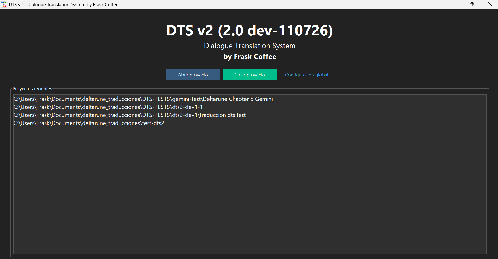

# DTS v2 — Dialogue Translation System


Traductor de diálogos de videojuegos (GameMaker) del inglés al español usando APIs de IA.

## ¿Que es?

DTS es una herramienta automatizada de código abierto diseñada para la traducción masiva de diálogos y textos en videojuegos basados en el motor de Toby Fox (Undertale y Deltarune). Mediante la integración en segundo plano del CLI de UndertaleModTool (UMT) y el poder de múltiples modelos de Inteligencia Artificial de última generación, DTS permite extraer, traducir e inyectar de vuelta los strings en el archivo data.win de forma 100% autónoma, rápida y sin necesidad de interactuar manualmente con líneas de comandos complejas.


## Documentación



La documentación completa está en el directorio [`docs/`](docs/):

- [Introducción](docs/index.md)
- [Instalación](docs/installation.md)
- [CLI — Línea de comandos](docs/cli.md)
- [GUI — Interfaz gráfica](docs/gui.md)
- [Proveedores de IA](docs/providers.md)
- [Archivos y configuración](docs/configuration.md)

## Uso rápido

```bash
# CLI
dts help

# GUI (sin argumentos)
dts
```

## 🔒 Código Abierto, Transparencia y Licencia

Este proyecto ha sido desarrollado con fines comunitarios y educativos. El código fuente está 
abierto al público para:
1. **Transparencia:** Permitir que cualquiera audite el código.
2. **Educación y Aportes:** Servir como referencia para otros desarrolladores y permitir contribuciones.

Está protegido bajo la licencia **[CC BY-NC 4.0](https://creativecommons.org/licenses/by-nc/4.0/deed.es)**. 
Puedes usar el código para tus propios proyectos productivos, pero **está estrictamente prohibida su 
apropiación, venta o cualquier tipo de uso comercial.**